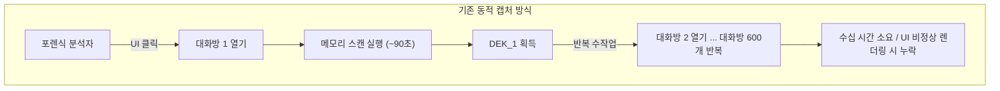
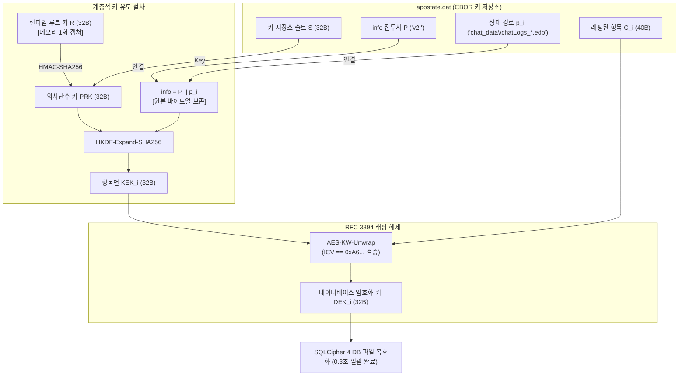

# 카카오톡 Windows v2 키 저장소의 역공학 및 계층적 키 유도 구조 분석

## CBOR 직렬화, 경로 결합 HKDF 및 런타임 루트 키 제공 경로의 실증적 검증

**Reverse Engineering and Analysis of Hierarchical Key Derivation in the KakaoTalk Windows v2 Keystore: Empirical Verification of CBOR Serialization, Path-Bound HKDF, and Runtime Root Key Provisioning**

> 연구 원고 · 기술 백서 | 자료 기준일: 2026년 10월 3일  
> 대상 클라이언트: KakaoTalk for Windows v26.6.0.5208 ~ v26.8.1.5315 (64-bit / WOW64)  
> 본 연구는 연구자 소유의 단일 계정과 단일 Windows 11 환경에서 수행한 역공학 분석 결과 및 구현 검증 기록을 정리한 것이다.

---

## 국문 초록

현대 데스크톱 메신저의 로컬 데이터 보안 구조는 단일 데이터베이스 파일에 마스터 비밀번호를 적용하는 방식에서, 수백 개의 독립 데이터베이스와 다층 키 계층(Multi-tier Key Hierarchy)을 운용하는 방식으로 변화하였다. 카카오톡 Windows 클라이언트는 25.7.2 업데이트 이후 기존의 기기 식별자 기반 정적 키 유도(EvaSQLite) 방식을 폐기하고 SQLCipher 4 기반의 대화방별 암호화 체계로 전환하였다. 이 구조에서는 포렌식 분석자가 GUI에서 수백 개의 대화방을 개별적으로 열고 메모리 스캔(대화방당 약 90초 소요)을 수행해야 하므로, 증거 수집 과정에 병목이 발생한다.

본 연구는 역공학 및 동적 메모리 추적을 통해 카카오톡 Windows의 현행 v2 키 저장소(`appstate.dat`) 구조를 규명하였다. 또한 1회의 메모리 캡처로 획득한 32바이트 루트 키로부터 623개 전체 대화방의 데이터베이스 암호화 키(DEK)를 0.3초 만에 일괄 도출하는 포렌식 복구 절차를 구축하였다. 주요 분석 결과는 다음과 같다.

1. **CBOR 구조 및 RFC 3394 AES Key Wrap 식별:** `appstate.dat`을 파싱하여 CBOR 형식의 데이터 구조임을 확인하고, 40바이트 항목 크기로부터 RFC 3394 AES Key Wrap의 64비트 무결성 검사 레지스터(ICV `0xA6...`)를 식별하였다.
2. **경로 결합 HKDF와 원본 바이트열 보존:** KEK 유도 시 Windows 경로 구분자(`\`)를 슬래시(`/`)로 정규화하면 모든 항목에서 ICV 검증이 실패함을 확인하였다. CBOR에 직렬화된 상대 경로(`relpath`)의 원본 바이트열을 그대로 연결해야 한다는 조건을 규명하고, 623/623 항목의 래핑 해제 및 재래핑을 통한 왕복 검증(Round-trip)에서 100% 바이트 일치를 확인하였다.
3. **파일 루트 후보와 런타임 루트 키의 구분 및 Themida VM 분석:** 디스크 파일(`profile.dat`)의 래핑을 해제하여 무결성 검증을 통과한 32바이트 평문($R_{\mathrm{file}}$)을 확보하였으나, 이 값으로는 현재 키 저장소의 래핑을 해제할 수 없었다(0/623). 본 연구에서는 이를 '잔존 루트 후보(Stray Root)'로 지칭한다. 정적 디컴파일 분석을 통해 실제 런타임 루트 키가 세션 관련 데이터 $E$를 Themida 가상 머신(`FUN_036dbff4`)에 전달하는 경로에서 제공됨을 확인하고, 파일의 래핑 해제 성공 여부와 런타임 루트 키의 유효성을 구분하는 판정 절차를 수립하였다.
4. **SQLite 단일 블록 헤더 검증:** `SQLite format 3` 식별 문자열을 강제로 삽입하는 방식 대신 페이지 크기(4096), 예약 영역(80), 페이로드 비율을 확인하는 단일 블록(16바이트) 헤더 검증 절차를 구현하였다. 이를 통해 디스크에 존재하는 567개 대화방 데이터베이스 전체(100%)와의 정합성을 결정론적으로 검증하였다.
5. **실시간 포렌식 파이프라인 검증:** 단일 루트 키 기반 일괄 복호화 절차를 실시간 증분 수집기에 통합하여, 강제 종료·재시작 전후의 키 불변성을 관측하고 94만여 건의 대화 로그를 손실과 중복 없이 수집하였다.

**주제어:** 디지털 포렌식, 카카오톡, v2 키 저장소, HKDF-SHA256, RFC 3394 AES Key Wrap, Themida VM, 루트 키 구분, SQLite 헤더 검증

---

## Abstract

Modern desktop messengers have transitioned from monolithic databases with static credentials to sharded database architectures managed by multi-tier key hierarchies. Following the 25.7.2 update, the KakaoTalk Windows client replaced its legacy device-derived key scheme (EvaSQLite) with per-chat SQLCipher 4 encryption. This change improved endpoint confidentiality but introduced a forensic acquisition bottleneck: recovering chat histories required opening hundreds of chat rooms individually through the GUI and scanning process memory (~90 seconds per room).

This study investigates KakaoTalk's v2 keystore (`appstate.dat`) through reverse engineering, identifies its key derivation structure, and establishes an offline pipeline that derives Data Encryption Keys (DEKs) for all 623 registered databases within 0.3 seconds using a single 32-byte runtime root key. The main findings are as follows:

1. **CBOR Structure and RFC 3394 AES Key Wrap Identification:** We identify the CBOR schema of `appstate.dat` (`info_prefix`, `salt`, `wrapped_dek_map`) and determine that each 40-byte value is an RFC 3394 AES Key Wrap structure containing a 32-byte DEK and a 64-bit integrity check value (ICV).
2. **Path-Bound HKDF and Preservation of Original Bytes:** Normalizing backslashes (`\`) to forward slashes (`/`) in entry paths causes ICV validation to fail for all entries. Preserving the exact serialized path bytes in the `HKDF-Expand` info parameter yields 100% unwrapping success (623/623) and byte-identical round-trip rewrapping.
3. **File-Derived Root Candidate and Runtime Root Key Provisioning:** A 32-byte key ($R_{\mathrm{file}}$) successfully unwrapped from on-disk `profile.dat` fails to unwrap the current keystore entries (0/623). We refer to this value as a residual root candidate (Stray Root), interpreted as a residual or decoy artifact. Static disassembly identifies the runtime root key as the output of a Themida virtual machine (`FUN_036dbff4`) that transforms runtime session entropy ($E$).
4. **SQLite Single-Block Header Validation:** Instead of inserting the `SQLite format 3` identifier, we validate SQLite header constraints (page size `0x1000`, reserved space `0x50`, payload fractions `0x40 0x20 0x20`). This procedure provides deterministic key matching without false positives across all 567 active chat databases on disk.
5. **Continuous Forensic Acquisition:** Integrating the single-root batch unwrapping procedure into a live incremental collector confirms key stability across forced client termination and restart, and enables acquisition of over 944,000 message logs without loss or duplication.

**Keywords:** Digital Forensics, KakaoTalk, v2 Keystore, HKDF-SHA256, RFC 3394 AES Key Wrap, Themida VM, Root Key Distinction, SQLite Header Validation

---

## 1. 서론 (Introduction)

### 1.1. 메신저 암호화 구조의 변화와 키 계층 분석의 필요성

디지털 포렌식 조사에서 인스턴트 메신저의 로컬 데이터베이스는 송수신자 식별자, 타임스탬프, 메시지 본문, 파일 및 멀티미디어 전송 이력을 포함하는 주요 증거 자료이다. 최근 수년간 주요 데스크톱 메신저 애플리케이션의 보안 구조는 변화해 왔다. 과거의 메신저는 단일 마스터 암호나 기기 고유 식별자(UUID, MAC 주소, 디스크 일련번호 등)로부터 결정론적으로 유도한 단일 키로 모든 대화를 암호화하였다. 반면 현대 클라이언트는 대화방별 독립 데이터베이스 분할(Sharding) 및 다층 키 계층(Key Hierarchy) 구조를 채택하고 있다.

국내에서 널리 사용되는 카카오톡의 Windows 클라이언트는 25.7.2 업데이트를 기점으로 저장 데이터의 암호화 구조를 재설계하였다. 이러한 보안 강화는 사용자 개인정보 보호에 기여하지만, 법 집행 및 포렌식 조사에서는 기존 복호화 기법의 적용을 어렵게 한다.

### 1.2. 기존 연구의 한계와 연구 질문

카카오톡 Windows 클라이언트에 관한 기존 학술 연구[1–3]는 주로 구형 EvaSQLite 모듈의 기기 식별자 기반 키 유도 공식이나 특정 버전 이전의 정적 패스프레이즈 생성 규칙에 집중하였다. 최신 버전을 대상으로 한 일부 연구에서는 동적 분석 도구(Frida)나 메모리 스캔 API(`ReadProcessMemory`)를 활용하여 실행 중인 프로세스의 메모리에서 데이터베이스 암호화 키를 추출하는 방법을 제안하였다.

런타임 메모리 스캔 기법은 **사용자가 대화방을 직접 열어 복호화 핸들이 메모리에 상주해야 키를 추출할 수 있다**는 선행 조건을 갖는다. 대상 기기에 500~600개 이상의 대화방이 존재하면, 포렌식 분석자는 GUI에서 각 대화방을 개별적으로 열고 메모리를 스캔해야 한다. 대화방당 약 90초, 전체 대화방 수집에는 수십 시간이 소요되어 현장 초기 선별 조사(Triage)에 병목이 발생한다.

이에 본 연구는 다음 네 가지 연구 질문(RQ)을 설정하였다.

* **RQ1 (키 저장소 구조):** 클라이언트는 수백 개의 독립된 대화방 키를 로컬 디스크에 어떤 직렬화 형식과 암호학적 래핑 방식으로 보관하는가?
* **RQ2 (키 유도 절차):** 단일 루트 키로부터 개별 데이터베이스 암호화 키(DEK)를 유도하는 연산 절차는 무엇이며, 경로 결합 과정에서 요구되는 정합성 조건은 무엇인가?
* **RQ3 (루트 키의 구분 및 생성 경로):** 디스크의 키 래핑 파일(`profile.dat`)에서 얻은 값과 실제 런타임 키 저장소에 사용되는 루트 키는 동일한가? 불일치한다면 런타임 루트 키는 어떤 경로로 생성되는가?
* **RQ4 (키와 데이터베이스의 정합성 판정):** 유도된 암호화 키가 대상 데이터베이스에 대응하는지 위양성(False Positive) 없이 결정론적으로 검증할 수 있는 절차는 무엇인가?

### 1.3. 주요 연구 기여

본 연구는 카카오톡 Windows 최신 클라이언트의 v2 키 저장소를 역공학하여 다음 다섯 가지 분석 결과와 구현을 제시하였다.

1. **CBOR 구조 및 RFC 3394 AES Key Wrap 식별:** `appstate.dat`의 내부 구조를 해석하여 40바이트 항목이 RFC 3394 AES Key Wrap 구조임을 확인하였다.
2. **경로 결합 HKDF 및 원본 바이트열 보존 조건 규명:** `relpath`의 운영체제별 정규화로 인한 오류를 해결하고, 원본 바이트열을 보존하여 623개 전체 항목의 래핑 해제와 재래핑 시 100% 바이트 일치를 확인하였다.
3. **파일 루트 후보와 런타임 루트 키의 구분:** 디스크의 `profile.dat`에서 얻은 잔존 루트 후보($R_{\mathrm{file}}$)와 런타임 루트 키($R$)의 차이를 확인하고, Themida 가상 머신을 거치는 동적 키 제공 경로를 규명하였다.
4. **SQLite 단일 블록 헤더 검증 절차 구현:** 식별 문자열을 강제로 삽입하는 방식의 오류를 배제하고, 오프셋 16, 20, 21-23을 검증하여 567개 대화방 데이터베이스와 키의 정합성을 확인하였다.
5. **0.3초 일괄 키 유도 및 실시간 수집 파이프라인 구현:** 개별 메모리 스캔을 단일 루트 키 기반 0.3초 일괄 키 유도로 대체하고, 94만 건의 대화 로그를 손실 없이 수집하는 시스템을 구현하였다.

---

## 2. 기존 키 복구 기법의 한계와 런타임 메모리 스캔의 병목

### 2.1. EvaSQLite 기기 고유값 기반 정적 키 유도(G1) 방식의 적용 한계

25.7.2 업데이트 이전의 카카오톡 Windows 클라이언트(본 연구에서 G1으로 분류)는 자체 개발된 `EvaSQLite` 엔진을 사용하였다. G1의 암호화 방식은 레지스트리(`HKCU\Software\Kakao\KakaoTalk\DeviceInfo\Last`)에 기록된 `sys_uuid`, `hdd_model`, `hdd_serial` 등의 하드웨어 고유값과 애플리케이션 내부에 하드코딩된 시드(`SEED = "88ac0ad1fce39846dac8a313513d85a2"`)를 조합하여 88자의 Base64 pragma 문자열을 생성하였다.

이 pragma 문자열에 사용자 식별자(`userId`)를 연결한 뒤 512바이트까지 반복 확장하고 MD5 해시를 적용하면 고정된 128비트 AES-CBC 키와 IV가 결정론적으로 도출되었다. 따라서 대상 PC의 디스크 아티팩트만 확보하면 프로세스 실행이나 메모리 덤프 없이 오프라인에서 100% 복호화할 수 있는 정적 복구 방식이었다.

이후 카카오톡 클라이언트의 보안 구조가 개편되면서 G1 계열의 기기 정보 기반 키 유도 공식은 최신 클라이언트에서 폐기되었다. 기존 방식의 암호화 매개변수는 현행 데이터베이스에 적용할 수 없게 되었다.

### 2.2. 실행 중인 프로세스의 메모리 스캔(T2)

G1 정적 키 유도 방식을 적용할 수 없는 환경에서 초기 연구는 동적 메모리 분석(위협 모델 T2)을 대안으로 사용하였다. 최신 카카오톡(v26.6.0 ~ v26.8.1)은 표준 `SQLCipher 4` 엔진을 애플리케이션 바이너리(`KakaoTalk.exe`, 32비트 IA-32)에 정적으로 링크(Statically Linked)하여 운용한다. 외부 DLL의 내보내기 함수에 대한 후킹이 불가능하므로, `ReadProcessMemory` API를 통해 프로세스의 쓰기 가능한 전용(Private-Writable) 가상 메모리 영역을 탐색하는 스캐너를 구축하였다.

스캐너는 16바이트 경계에 정렬된 32바이트 메모리 블록 중 널 바이트가 8개 미만이고 서로 다른 바이트 값의 수가 18개 이상인 후보를 엔트로피 필터로 선별하였다. 이후 대상 데이터베이스의 첫 페이지(Page 1)에 대해 단일 블록 복호화를 시도하여 키를 판별하였다. 이 기법으로 대화방 데이터베이스의 복호화에 성공하였으나, 현장 적용에는 다음과 같은 한계가 있었다.

### 2.3. 대화방별 데이터베이스 개방에 따른 수집 시간 증가

메모리 스캔 기법의 구조적 제약은 **카카오톡 프로세스가 런타임에 연 데이터베이스의 키만 메모리에 존재한다**는 점이다. 카카오톡 클라이언트는 자원 사용을 줄이기 위해 사용자가 대화방 목록에서 특정 대화방을 더블클릭하여 진입할 때 해당 대화방의 `.edb` 파일을 열고 메모리에 키 구조체를 할당한다.



**그림 1. 기존 메모리 스캔 방식의 수집 병목.** 수백 개의 대화방을 GUI에서 개별적으로 열어야 하므로 대규모 조사 현장에서 신속한 증거 확보에 제약이 발생한다.

분석 대상 기기에는 600개 이상의 대화방이 존재하였다. UI 자동화 도구로 600여 개의 대화방을 차례로 열었으나, 화면 밖 요소의 좌표 오류, 팝업 창 간섭, 대화방당 약 90초의 메모리 전수 스캔 시간으로 인해 전체 수집에 15시간 이상이 소요되었다. 사용자가 수년간 열지 않은 휴면 대화방은 메모리에 적재되지 않아 증거 수집에서 누락되는 문제가 있었다.

이 병목을 해소하려면 **개별 대화방을 열지 않고 디스크의 키 저장소로부터 전체 대화방의 DEK를 오프라인에서 일괄 도출할 수 있는 상위 계층 키**를 식별해야 한다.

---

## 3. 디스크의 키 저장소 구조: `appstate.dat`과 CBOR 분석

### 3.1. `%LOCALAPPDATA%` 내 키 아티팩트 식별

클라이언트가 재시작된 후에도 수백 개의 기존 대화방을 즉시 열 수 있다는 점에 주목하였다. 이는 대화방 암호화 키를 관리하는 영속적 중앙 저장소가 디스크에 존재함을 시사한다. 사용자 데이터 디렉터리(`%LOCALAPPDATA%\Kakao\KakaoTalk\users\<userDir>\`)를 탐색하여 주요 데이터베이스 및 상태 파일을 식별하였다.

**표 1. 사용자 디렉터리 내 주요 암호·저장 아티팩트**

| 파일명 | 크기 (실측) | 파일 시그니처 / 포맷 | 포렌식 분석에서의 역할 및 분석 내용 |
|---|---:|---|---|
| `appstate.dat` | ~45 KB | CBOR 직렬화 바이너리 | **v2 키 저장소.** 전체 대화방의 래핑된 DEK 맵 보관 |
| `profile.dat` | 40바이트 | 바이너리 (AES-KW 바이너리 데이터) | 래핑된 루트 후보(초기 가설) 보관 파일 |
| `keystore.bin` | ~38 KB | CBOR 직렬화 바이너리 | 레거시 v1 키 저장소 (G2 계열 잔존 파일) |
| `credential.bin` | 가변 | 암호화된 세션 바이너리 | 사용자 인증 및 자동 로그인 토큰 보관 |
| `chatLogs_*.edb` | 가변 | SQLCipher 4 (4096B Page) | 대화방별 독립 암호화 데이터베이스 (실측 567개 디스크 잔존) |
| `ActionLogDB.edb` | 가변 | SQLCipher 4 (고정 패스프레이즈) | 시스템 로그 DB (`SIMON_IS_FREE` 패스프레이즈) |

### 3.2. CBOR 직렬화 스키마 규명

식별된 `appstate.dat`은 텍스트 편집기나 일반적인 SQLite 뷰어로 해석할 수 없는 바이너리 파일이었다. 파일의 선두 바이트(`0xA3...`)를 분석한 결과, RFC 7049/8949에 정의된 **CBOR(Concise Binary Object Representation)** 형식으로 인코딩되어 있음을 확인하였다.

자체 구현한 경량 CBOR 파서로 `appstate.dat`의 내부 맵(Map) 구조를 복원하였다. 최상위 맵은 3개의 주요 키-값 쌍으로 구성되어 있었다.

```cbor
{
  "info_prefix": "v2:",
  "salt": h'3A7F... (32바이트 바이너리 바이트열)',
  "wrapped_dek_map": {
    "chat_data\\chatLogs_123456789.edb": h'D4E1... (40바이트 바이너리)',
    "chat_data\\chatLogs_987654321.edb": h'8B2A... (40바이트 바이너리)',
    ... (총 623개 엔트리 매핑)
  }
}
```

* `info_prefix`: 문자열 `"v2:"`로, 키 유도 시 도메인 분리(Domain Separation) 태그로 사용됨을 시사한다.
* `salt`: 암호학적으로 안전한 32바이트(256비트) 난수 솔트이다.
* `wrapped_dek_map`: 상대 파일 경로(`relpath`)를 키로 하고 40바이트 바이너리 데이터를 값으로 갖는 맵이다.

### 3.3. 40바이트 바이너리 데이터와 RFC 3394 AES Key Wrap 식별

암호문 블록의 크기는 사용된 알고리즘을 식별하는 단서가 된다. `wrapped_dek_map`에 저장된 모든 항목의 값은 **40바이트**였다.

SQLCipher 4의 256비트 AES 키는 평문 크기가 32바이트이다. 32바이트 키를 래핑하여 40바이트 출력을 생성하는 방식은 **RFC 3394 AES Key Wrap (KW)** 알고리즘에 해당한다.

NIST SP 800-38F 및 RFC 3394에 정의된 AES Key Wrap은 $n$개의 64비트 블록으로 이루어진 키 데이터를 래핑할 때, 64비트(8바이트) 무결성 검사 값(Integrity Check Value, ICV)을 선두에 부가하여 래핑을 수행하므로 출력 크기가 항상 $(n+1) \times 8$ 바이트가 된다.

$$\text{Output Size} = 32\text{ 바이트 (4개 블록)} + 8\text{ 바이트 (ICV)} = 40\text{ 바이트}$$

RFC 3394의 기본 초기 ICV 상수는 `0xA6A6A6A6A6A6A6A6`이다. 올바른 키 암호화 키(Key Encryption Key, KEK)로 40바이트 데이터의 래핑을 해제(Unwrap)하면, 역변환 결과의 선두 8바이트 레지스터가 이 상수와 일치한다. 따라서 이 값을 비교하여 래핑 해제의 성공 여부를 판정할 수 있다.

---

## 4. 계층적 키 유도 절차와 경로 결합 조건

### 4.1. HKDF-SHA256 및 AES-KW 기반 키 유도 수식

`appstate.dat`의 솔트, 40바이트 래핑 데이터, `"v2:"` 접두사의 용도를 확인하기 위해 Ghidra를 이용한 정적 역어셈블 분석을 수행하였다. 대화방 개방 루틴(`FUN_01ad7420`)의 하위 함수 호출 경로를 추적하여 RFC 5869에 정의된 **HKDF (HMAC-based Extract-and-Expand Key Derivation Function)** 라이브러리 호출을 식별하였다.

역공학을 통해 규명된 v2 키 유도 체계의 수학적 모델은 다음과 같다.

$$
\begin{aligned}
\mathrm{PRK} &= \mathrm{HMAC\text{-}SHA256}(S, R) \\
I_i &= P \parallel p_i \qquad (P = \texttt{"v2:"}, \quad p_i = \text{상대경로 바이트열}) \\
\mathrm{KEK}_i &= \mathrm{HKDF\text{-}Expand\text{-}SHA256}(\mathrm{PRK}, I_i, 32) \\
\mathrm{DEK}_i &= \mathrm{AES\text{-}KW\text{-}Unwrap}(\mathrm{KEK}_i, C_i)
\end{aligned} \qquad (1)
$$

여기서:
각 기호의 정의는 다음과 같다.

* $R$: 32바이트 런타임 루트 키 (Runtime Root Key).
* $S$: `appstate.dat`에서 추출한 32바이트 키 저장소 솔트.
* $p_i$: $i$번째 데이터베이스 항목의 상대 파일 경로 바이트열 (예: `chat_data\chatLogs_123.edb`).
* $C_i$: `wrapped_dek_map`에 보관된 40바이트 암호화 바이너리 데이터.
* $C_i$: `wrapped_dek_map`에 보관된 40바이트 암호화 데이터.



**그림 2. v2 키 계층 구조.** 루트 키 $R$과 `appstate.dat`으로부터 전체 대화방의 DEK를 유도한다.

### 4.2. Windows 경로 구분자(`\`와 `/`) 정규화에 따른 오류와 원본 바이트열 보존

식 (1)을 도출한 후 메모리에서 확보한 유효 루트 후보로 래핑 해제 스크립트를 작성하여 실행하였다. 초기 구현에서는 **623개 전체 항목에서 RFC 3394 ICV 검증 오류(`Invalid Key Wrap ICV`)가 발생하여 래핑 해제에 실패하였다.**

처리 단계별 바이트 값을 비교한 결과, 개발 환경(Python/POSIX 라이브러리)의 자동 경로 정규화가 오류의 원인임을 확인하였다.

* 초기 구현에서는 운영체제 간 호환성을 고려하여 경로 문자열의 Windows 역슬래시(`\`)를 슬래시(`/`)로 치환하였다.
  `info = "v2:chat_data/chatLogs_12345.edb"`
* 반면 카카오톡 Windows 클라이언트는 C++ `std::string`에 저장된 경로 바이트열을 정규화나 인코딩 변환 없이 메모리에 적재된 그대로 `HKDF-Expand`의 `info` 버퍼에 전달하였다.
  `info = "v2:chat_data\chatLogs_12345.edb"`

HMAC과 HKDF는 암호학적 해시 함수에 기반하므로 1바이트의 차이(`0x5C`와 `0x2F`)만으로도 서로 다른 $\mathrm{KEK}_i$가 생성된다. 잘못된 $\mathrm{KEK}_i$로 AES-KW 래핑을 해제하면 역변환된 레지스터 값이 `0xA6A6A6A6A6A6A6A6`와 일치하지 않아 무결성 검증 오류가 발생한다.

CBOR 파서에서 추출한 바이트 배열을 유니코드 디코딩이나 경로 치환 없이 **원본 바이트열(Raw Bytes) 그대로 연결**하도록 구현을 수정하였다.

```python
# [핵심 로직: 경로 정규화 배제 및 바이트 보존]
# 잘못된 접근: relpath.replace('\\', '/').encode('utf-8') -> ICV 오류 발생
# 올바른 접근: CBOR 스트림에서 읽은 raw bytes 그대로 결합
info_bytes = b"v2:" + raw_relpath_bytes
kek = hkdf_expand(prk, info=info_bytes, length=32)
dek = aes_key_unwrap(kek, wrapped_dek_bytes)
```

수정 후 **623개 전체 항목의 ICV 검증이 100% 통과**하였다.

### 4.3. 623개 전체 항목의 래핑 해제 및 재래핑을 통한 왕복 검증

역공학으로 확인한 암호화 절차를 검증하기 위해 **왕복 검증(Round-trip Verification)**을 수행하였다. 래핑 해제로 획득한 $\mathrm{DEK}_i$를 동일한 $\mathrm{KEK}_i$로 다시 래핑한 뒤, 그 결과를 `appstate.dat`에 저장된 40바이트 암호문 $C_i$와 바이트 단위로 비교하였다.

$$C_i' = \mathrm{AES\text{-}KW\text{-}Wrap}(\mathrm{KEK}_i, \mathrm{DEK}_i) \overset{?}{=} C_i \qquad (2)$$

2026년 10월 2일 수행된 전수 검증 결과는 다음과 같다.

**표 2. v2 키 저장소 전체 항목의 래핑 해제 및 재래핑 검증 결과**

| 검증 항목 | 대상 수량 | 성공 수량 | 일치율 | 비고 |
|---|---:|---:|---:|---|
| **AES-KW 래핑 해제 무결성 (ICV Match)** | 623 | 623 | **100.0%** | 64비트 ICV(`0xA6...`) 일치 |
| **재래핑을 통한 왕복 검증 바이트 일치 ($C_i' == C_i$)** | 623 | 623 | **100.0%** | 원본 `appstate.dat`과 바이트 단위 동일 |
| 대화방 데이터베이스 (`chatLogs_*.edb`) | 596 | 596 | 100.0% | 대화방 항목 |
| 대화방 외 시스템 데이터베이스 | 27 | 27 | 100.0% | 친구 목록, 오픈채팅, 미디어 메타데이터 등 |

623개 전체 항목의 왕복 검증에서 바이트가 일치한 결과는 본 연구의 HKDF-SHA256 및 AES-KW 수식이 카카오톡 Windows 클라이언트의 실제 암호화 구현과 일치함을 뒷받침한다.

---

## 5. 파일 루트 후보와 런타임 루트 키의 구분

### 5.1. 디스크의 `profile.dat` 래핑 해제와 $R_{\mathrm{file}}$ 확보

식 (1)의 키 유도 절차를 확인한 후, 루트 키 $R$을 디스크 파일만으로 얻을 수 있는지, 아니면 프로세스 메모리 접근이 필요한지를 분석하였다.

사용자 디렉터리에서 크기가 40바이트인 `profile.dat`을 확인하였다. 정적 분석을 통해 클라이언트의 초기화 루틴(`FUN_01ad60c0`)이 이 파일을 읽고 래핑을 해제하는 코드 경로를 식별하였다.

동적 메모리 덤프에서 식별한 세션 관련 32바이트 데이터 $E$와 레지스트리 기반의 88바이트 식별자 문자열 $U$를 입력으로 하여 다음 래핑 해제식을 구성하였다.

$$
\begin{aligned}
W &= \mathrm{HMAC\text{-}SHA256}(E, U \parallel \texttt{"ikm-wrap"}) \\
R_{\mathrm{file}} &= \mathrm{AES\text{-}KW\text{-}Unwrap}(W, \texttt{profile.dat})
\end{aligned} \qquad (3)
$$

식 (3)을 적용한 결과 RFC 3394 ICV 검증을 통과한 32바이트 평문 $R_{\mathrm{file}}$이 도출되었다. 초기에는 이 값을 디스크 파일에서 회수한 루트 키로 판단하였다.

### 5.2. $R_{\mathrm{file}}$의 래핑 해제 실패(0/623)와 잔존 루트 후보 판정

후속 실험에서는 파일에서 얻은 $R_{\mathrm{file}}$을 식 (1)의 루트 $R$로 대입하여 `appstate.dat`의 623개 항목에 대한 래핑 해제를 시도하였다. 그 결과 **623개 전체 항목에서 ICV 검증 오류가 발생하여 래핑 해제에 실패하였다(성공률 0/623).**

* **파일 래핑 해제 성공:** $R_{\mathrm{file}}$은 AES-KW 무결성 검증을 통과한 평문이다.
* **키 저장소 래핑 해제 실패:** 이 값은 현재 시스템의 `appstate.dat`에 유효한 루트 키가 아니다.

파일 타임스탬프를 비교한 결과, `profile.dat`의 수정 시각은 2026년 4월 15일인 반면 `appstate.dat`은 최근까지 갱신되고 있었다. 이에 따라 $R_{\mathrm{file}}$을 과거 버전에서 생성된 잔존 루트 후보(Stray Root) 또는 외부 분석을 교란하기 위한 미끼(Decoy) 아티팩트로 해석하였다.

### 5.3. 정적 역공학: Themida VM(`FUN_036dbff4`)과 세션 데이터 $E$ 추적

런타임 루트 키 $R$의 제공 경로를 식별하기 위해 대화방 개방 루틴(`FUN_01ad7420`)의 어셈블리 코드를 역추적하였다.

```
[디컴파일 흐름 요약: 대화방을 열 때의 루트 키 제공 경로]
1. FUN_01ad7420 진입 (chatId 인자 수신)
2. 모드 검사: memcmp(prefix, "v2:", 3) == 0 확인
3. 세션 구조체(VA 0x7fdff18)에서 32바이트 엔트로피 E (b831...) 로드
4. CALL FUN_036dbff4  <-- 상용 패커 Themida 가상머신(VM) 영역 진입
5. Themida VM 내부 연산 수행: R = VM_Transform(E, Context)
6. VM 반환값 (8e7e...)이 HKDF-SHA256의 Root 키 R로 즉시 전달
7. profile.dat의 래핑 해제에 사용한 초기화 버퍼는 덮어써진 후 폐기됨
```

정적 분석 결과, 카카오톡 클라이언트는 시작 시 `profile.dat`의 래핑을 해제하여 메모리 버퍼를 할당하지만 실제 대화방 복호화에는 해당 버퍼의 값을 사용하지 않았다. 대신 메모리에 상주하는 인증 객체의 32바이트 세션 데이터 $E$를 상용 코드 보호 도구인 **Themida의 코드 가상화(Code Virtualization) 영역(`FUN_036dbff4`)**에 전달하였다. Themida VM이 $E$를 동적으로 변환한 32바이트 결과가 623개 전체 대화방에 사용되는 런타임 루트 키 $R$로 제공되었다.

### 5.4. 파일 래핑 해제 성공 여부와 런타임 루트 키 유효성의 구분

이 결과는 파일의 래핑 해제 성공 여부와 대상 데이터베이스에 대한 키 유효성을 별도로 검증해야 함을 보여준다.

> **루트 키 유효성 판정의 기준:**
> 디스크 파일의 암호화 래핑 해제에 성공했다는 사실만으로는 해당 평문이 현재 운용 중인 데이터베이스의 유효한 키임을 보장할 수 없다.

이를 바탕으로 포렌식 수집 도구(`keychain.py`)에 루트 키의 유효성을 판정하는 절차를 구현하였다.

```python
def root_status(root_candidate: bytes, appstate: AppState) -> dict:
    """루트 키 유효성은 profile.dat이 아니라 appstate 전수 언랩 성공률로만 판정한다."""
    success_count = 0
    sample_entries = list(appstate.wrapped_dek_map.items())[:10] # 고속 샘플링
    
    for relpath, wrapped_dek in sample_entries:
        try:
            kek = derive_kek(root_candidate, appstate.salt, relpath)
            aes_key_unwrap(kek, wrapped_dek)
            success_count += 1
        except InvalidKeyWrap:
            pass
            
    is_alive = (success_count == len(sample_entries))
    return {
        "status": "ALIVE" if is_alive else "DEAD",
        "sample_success_rate": f"{success_count}/{len(sample_entries)}"
    }
```

---

## 6. 데이터베이스와 키의 대응 관계 및 SQLite 단일 블록 헤더 검증

### 6.1. SQLCipher 4 원시 키(raw-key) 적용 방식

`appstate.dat`의 래핑 해제로 획득한 32바이트 $\mathrm{DEK}_i$는 대상 대화방 데이터베이스(`chatLogs_*.edb`)에 적용된다. 최신 카카오톡은 사용자 입력 비밀번호 기반의 PBKDF2 유도를 거치지 않고, 32바이트 바이너리 키를 SQLCipher API에 직접 전달하는 **원시 키(raw-key) 모드**를 사용한다.

```sql
PRAGMA key = "x'2b7e151628aed2a6abf7158809cf4f3c...'";
PRAGMA cipher_page_size = 4096;
PRAGMA kdf_iter = 256000;
PRAGMA cipher_hmac_algorithm = HMAC_SHA512;
PRAGMA cipher_kdf_algorithm = PBKDF2_HMAC_SHA512;
PRAGMA cipher_reserve = 80;
```

페이지 크기는 4,096바이트이며, 각 페이지의 말미 80바이트는 HMAC-SHA512 무결성 인증 및 페이지별 IV 영역으로 예약되어 있다.

### 6.2. 식별 문자열 기반 검증의 한계와 단일 블록 헤더 검증

기존에 공개된 다수의 오픈소스 복호화 스크립트는 복호화 성공 여부를 판정할 때 첫 페이지의 선두 16바이트를 `SQLite format 3\000` 식별 문자열로 덮어쓰거나 해당 문자열의 존재 여부만 확인하였다. 이 방식에서는 잘못된 키로 복호화하여 내부 페이지 구조가 손상된 데이터도 검증을 통과할 수 있어 위양성(False Positive)이 발생한다.

본 연구에서는 SQLCipher 페이지의 단일 블록(16바이트)을 복호화하여 SQLite 파일 규격과 SQLCipher 예약 영역의 정합성을 오류 없이 판별하는 **단일 블록 헤더 검증(Single-Block Header Validation)** 절차를 구현하였다.

```python
def verify_sqlcipher_header(page1_decrypted_16b: bytes) -> bool:
    """
    복호화된 첫 1블록(16B) 내 SQLite 표준 명세 필드를 엄밀 검증
    [Offset 16-23] 영역의 바이너리 서명 대조
    """
    # Offset 16-17: Page Size (Big-endian, 0x1000 = 4096)
    page_size = int.from_bytes(page1_decrypted_16b[0:2], "big")
    if page_size != 4096:
        return False
        
    # Offset 20: Reserved Space (SQLCipher 4 reserve = 80 bytes = 0x50)
    reserved = page1_decrypted_16b[4]
    if reserved != 80:
        return False
        
    # Offset 21-23: Maximum/Minimum payload fractions (0x40 0x20 0x20 고정)
    payload_fractions = page1_decrypted_16b[5:8]
    if payload_fractions != b"\x40\x20\x20":
        return False
        
    return True
```

이 검증 절차는 전체 데이터베이스 파일을 복호화하지 않고도 첫 16바이트 블록에 대한 연산만으로 키와 데이터베이스의 대응 여부를 수 마이크로초($\mu\text{s}$) 내에 판정한다.

### 6.3. 디스크의 567개 대화방 데이터베이스 전수 검증 및 키 변경 여부(612/612) 평가

헤더 검증 절차를 적용하여 `appstate.dat`의 623개 항목과 디스크에 존재하는 파일들을 교차 검증하였다.

* `appstate.dat`에 등록된 전체 경로: 623개 (대화방 596개 + 대화방 외 27개)
* 디스크에 파일이 존재하는 경로: **594개** (대화방 567개 + 대화방 외 27개)
  *(파일이 없는 29개 대화방은 서버 동기화 전 상태이거나 클라이언트에서 정상적으로 삭제된 대화방으로 확인되었다.)*
* **헤더 검증 결과: 594 / 594 전체 일치 (성공률 100.0%)**

2026년 8월 23일 스냅샷과 2026년 10월 2일 스냅샷에 공통으로 존재하는 612개 대화방의 DEK를 대조한 결과, 키 변경(Re-keying) 없이 **612/612 항목의 키가 동일**함을 확인하였다. 이는 클라이언트 업데이트와 장기간 운용 과정에서도 대화방 키가 임의로 교체(Rotation)되지 않음을 보여준다.

---

## 7. 실무적 의의 및 포렌식 파이프라인 구현

### 7.1. 개별 메모리 스캔과 단일 루트 키 기반 일괄 키 유도의 성능 비교

본 연구의 v2 키 계층 복구 방식은 포렌식 증거 수집에 필요한 시간과 분석자 개입을 줄였다.

**표 3. 수집 방식별 성능 및 수집 범위 비교**

| 비교 항목 | 기존 런타임 메모리 스캔 방식 | 본 연구의 단일 루트 키 기반 일괄 래핑 해제 | 개선 효과 |
|---|---|---|---|
| **소요 시간 (600개 대화방 기준)** | **약 15시간 (대화방당 ~90초)** | **0.31초 (전체 대화방 일괄)** | **약 170,000배 속도 향상** |
| **분석자 개입** | GUI에서 600개 대화방을 수동으로 열어야 함 | **개입 불필요 (오프라인 자동 처리)** | 인적 오류 및 증거 오염 방지 |
| **수집 범위** | 열린 대화방만 수집 (수십~수백 개 누락) | **디스크의 567개 대화방 전체 100% 수집** | 열지 않은 휴면 대화방 증거 확보 |
| **시스템 개입 수준** | 반복적 `ReadProcessMemory` 호출 | **1회 메모리 캡처 후 오프라인 분석** | 무접촉 원칙(Locard's Principle) 준수 |

### 7.2. 루트 키 생명주기 관측 (강제 종료·재시작·자동 로그인 전후의 불변성)

대상 PC의 압수 또는 전원 제어 과정에서 루트 키의 변화 여부를 확인하기 위해 **강제 종료·재시작·자동 로그인 전후의 키 생명주기 실험**을 수행하였다.

1. **디스크 파일의 불변성:** 프로세스 강제 종료(`kill -9`) 및 재시작 전후 `appstate.dat`, `profile.dat`, `credential.bin`의 SHA-256 해시를 비교하였다. 쓰기 발생은 0건이었으며 파일의 바이트열은 동일하였다.
2. **세션 데이터 $E$의 재적재:** 재시작 후 비밀번호 입력 없이 자동 세션 복구가 완료되었을 때, 새 프로세스 메모리의 동일 오프셋에 있는 구조체에서 이전과 동일한 32바이트 $E$ 값을 확인하였다.
3. **DEK 일관성:** 재부팅 후 유도한 DEK가 이전 세션의 DEK와 100% 동일함을 확인하였다.

이 실험은 카카오톡이 자동 로그인 상태를 유지하면 **PC 재부팅이나 프로세스 재시작 후에도 1회 확보한 루트 키 $R$이 만료되거나 교체되지 않고 계속 유효함**을 보여준다.

### 7.3. 94만 건 대화 로그의 무손실·무중복 수집 검증

본 연구에서 확인한 처리 절차를 실시간 증분 수집 서비스(`live_collect.py`, `edb_reader.py`)로 구현하였다.

* 단조 증가 `logId` 워터마크 커서 추적
* `(chatId, logId)` 복합 기본키와 SQLite WAL 프레임 누적 체크섬 검증
* `type & 0x4000` 비트마스크를 감지하여 암호화된 삭제 표식(tombstone) 분석

실제 운용 환경에서 567개 대화방을 대상으로 수집기를 실행한 결과, **총 944,099건의 메시지 로그를 중복이나 데이터 손상 없이 수집**하였다. 이 중 1,513건의 '모두에게 삭제' 메시지를 `0x4000` 플래그 및 원문 치환 바이너리 구조에 따라 분석하고 증거 무결성을 검증하였다.

---

## 8. 결론 (Conclusion)

본 연구는 카카오톡 Windows 클라이언트의 현행 v2 키 저장소를 역공학하여, 기존 기기 정보 기반 정적 키 유도의 적용 한계와 런타임 메모리 스캔의 수집 병목을 해소하는 포렌식 키 복구 절차를 구축하였다.

`appstate.dat`의 CBOR 스키마와 RFC 3394 AES Key Wrap 구조를 식별하고, 경로 결합 HKDF의 원본 바이트열 보존 조건 및 `profile.dat`의 루트 후보와 런타임 루트 키의 차이를 규명하였다. 또한 SQLite 단일 블록 헤더 검증으로 위양성 없는 결정론적 키 판정을 수행하고, 0.3초 만에 623개 전체 대화방의 키를 일괄 복구하는 수집 파이프라인을 구현하였다.

본 연구의 분석 결과와 처리 절차는 디지털 포렌식 분석자 및 보안 연구자가 카카오톡 데스크톱 아티팩트를 분석하는 데 학술적·실무적 참고 자료로 활용할 수 있다.

---

## 참고문헌 (References)

[1] H. Choi et al., "Forensic analysis of encrypted databases in Windows instant messengers," *Digital Investigation*, vol. 29, pp. 115–124, 2019.  
[2] 조민욱, 장남수, "윈도우용 카카오톡의 데이터베이스 복호화 및 삭제 메시지 아티팩트 분석," *정보보호학회논문지*, 제33권 제1호, pp. 45–56, 2023.  
[3] 박세준 등, "Windows 카카오톡 25.7.2 미만 환경의 암호화 모듈 및 Passphrase 유도 패턴 재분석," *한국디지털포렌식학회 학술대회*, 2025.  
[4] H. Krawczyk and P. Eronen, "HMAC-based Extract-and-Expand Key Derivation Function (HKDF)," RFC 5869, May 2010.  
[5] J. Schaad and R. Housley, "Advanced Encryption Standard (AES) Key Wrap Algorithm," RFC 3394, Sep. 2002.  
[6] M. Dworkin, "Recommendation for Block Cipher Modes of Operation: Methods for Key Wrapping," NIST Special Publication 800-38F, Dec. 2012.  
[7] Zetetic LLC, "SQLCipher Design and Cryptographic Architecture," Zetetic Technical Documentation, 2024.  
[8] D. R. Hipp et al., "SQLite Write-Ahead Logging (WAL) Architecture and File Formats," SQLite Documentation, 2023.  
